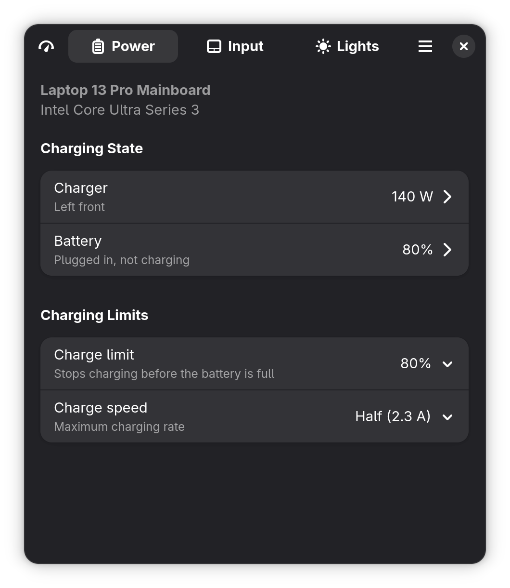
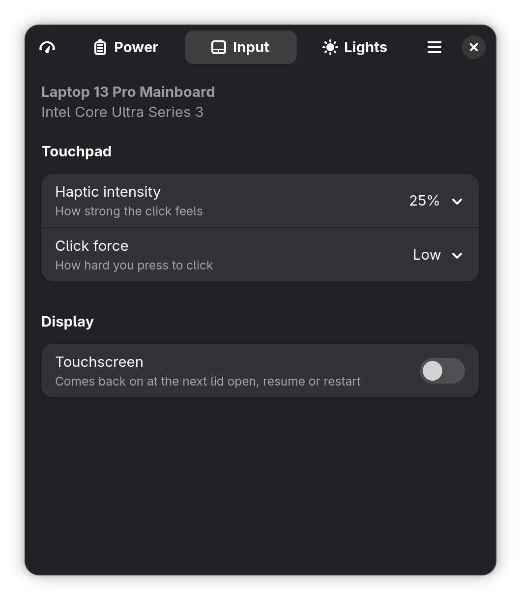
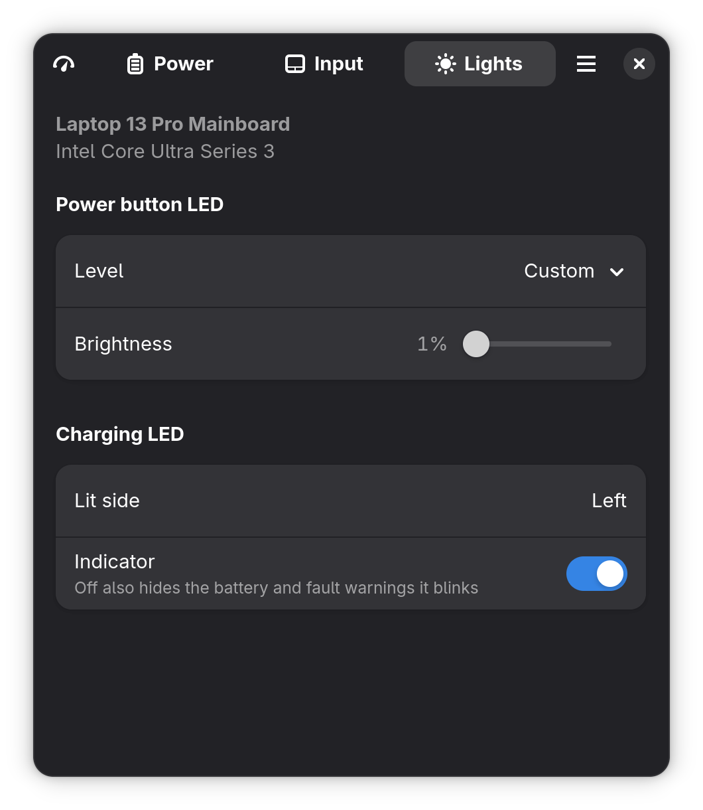
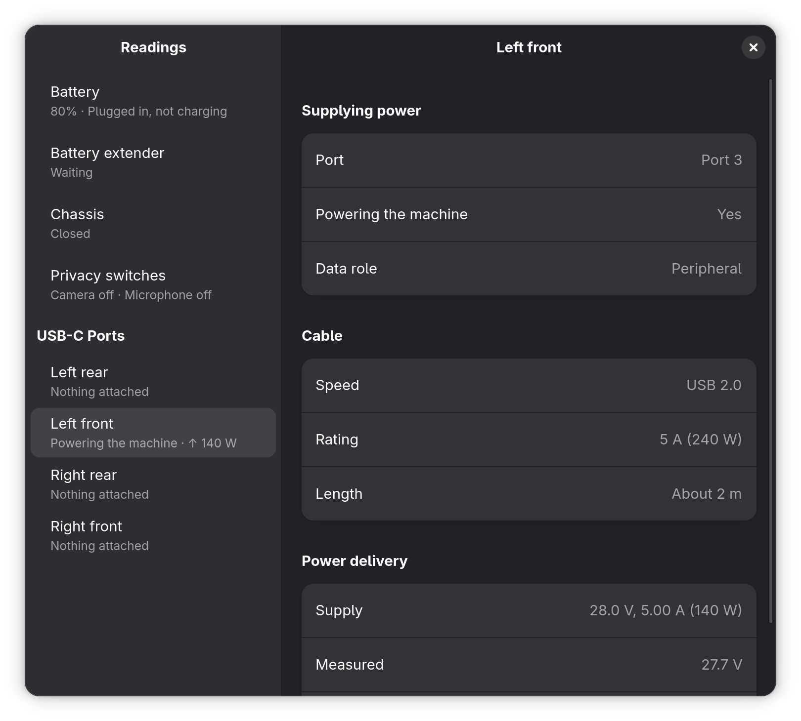
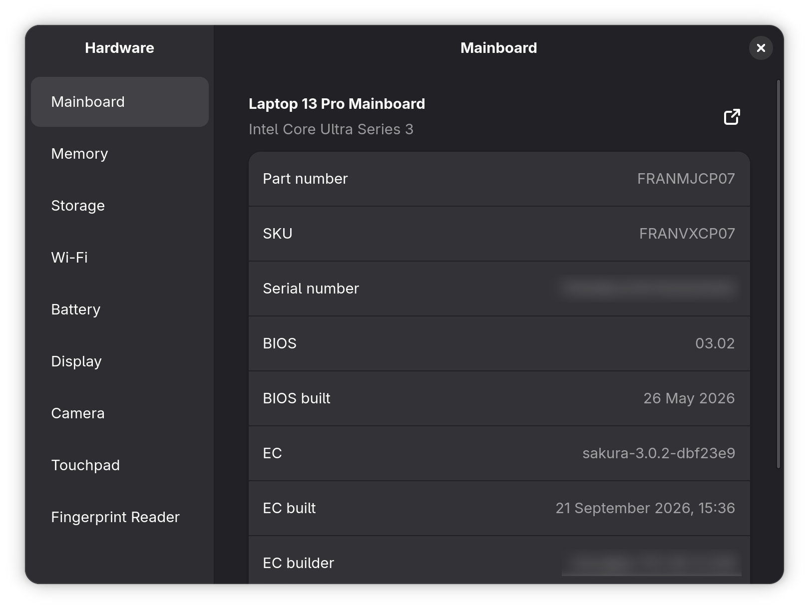
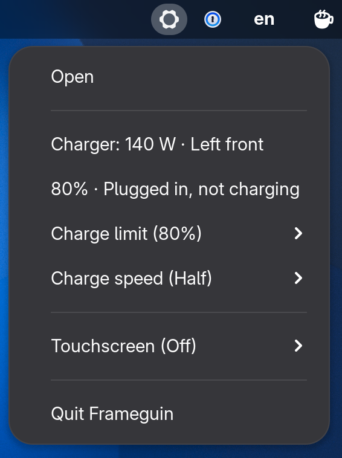

# Frameguin

An app for the hardware of a Framework laptop. It changes the settings the
firmware exposes, from a window or a tray icon, and shows what the machine is
doing and what it is built from. The GUI runs unprivileged and asks a small
system service for everything it does.

Frameguin is pre-1.0, and more of `framework_tool`'s surface is planned.

This is a community project, not affiliated with or endorsed by Framework
Computer Inc. "Framework" and the gear logo are trademarks of Framework
Computer Inc. Licensed under the [MIT License](LICENSE).

[**Latest release**](https://github.com/valeronm/frameguin/releases/latest)
· [Install](#install) · [Report a bug](https://github.com/valeronm/frameguin/issues)

<p align="center">
  
  
  
</p>

## What it does

The main window has a tab per kind of control, each showing only what the
board supports:

- **Power** — what the charger is supplying and on which port, what the
  battery is doing, the charge limit, and the charge speed.
- **Input** — the touchpad's haptic intensity and click force, and
  switching the touchscreen off.
- **Lights** — the power button LED's brightness, switching the charging LED
  off, and which side's charging LED is lit.

The other windows only read:

- **Readings** — what the machine is doing now: the battery's charge, flow
  and health, what each USB-C port has attached and the power it negotiated,
  the battery extender, the chassis, and the privacy switches.
- **Hardware** — every part the daemon found, with its identity and
  firmware.

<p align="center">
  
  
</p>

The tray menu holds what changes several times a day: the charger and
battery, the charge limit and speed, and the touchscreen. Closing the window
hides it to the tray; **Quit**, in the main menu or the tray, exits. **Start
at login**, in Preferences, brings up the tray icon only.

<p align="center">
  
</p>

At every restart the firmware resets the charge limit and the power button
LED's level to what BIOS setup stores, so set a standing charge limit there.
A touchscreen switched off turns back on when the lid opens, after a suspend
and at restart. **Restore settings**, in Preferences, reapplies the charge
limit, the charge speed, the power button LED's level and the touchscreen
after a restart or a resume. Either LED switched off lights again at restart
regardless.

## Install

Frameguin needs:

- **A Framework computer's embedded controller (EC).** Almost every control
  goes through it, so third-party mainboards built for the same chassis are
  not supported.
- **GTK 4 with libadwaita 1.5 or newer** — Ubuntu 24.04, Debian 13, Fedora 40
  or their equivalents.
- **systemd and polkit** — the daemon is started by systemd and authorizes
  every change through polkit.
- **A tray implementation, for the tray icon only.** KDE and Xfce have one
  natively; stock GNOME needs the
  [AppIndicator extension](https://extensions.gnome.org/extension/615/appindicator-support/)
  (preinstalled on Ubuntu). Without it there is no tray menu, and **Start at
  login** leaves nothing visible.

Both ways install a prebuilt release, built for x86_64 only; on other
architectures, build from source. With the install script:

```sh
curl -fsSL https://raw.githubusercontent.com/valeronm/frameguin/main/packaging/get.sh | sh
```

The script downloads as your user and runs only the installer under `sudo`.
Read it first if you'd rather — it is [packaging/get.sh](packaging/get.sh).

By hand, from the
[latest release](https://github.com/valeronm/frameguin/releases/latest): download
`frameguin-<version>-x86_64-linux.tar.xz` and the `.sha256` beside it, then

```sh
sha256sum -c frameguin-*-x86_64-linux.tar.xz.sha256
tar -xJf frameguin-*-x86_64-linux.tar.xz
sudo ./frameguin-*-x86_64-linux/install.sh
```

The installer checks for GTK 4 and libadwaita before writing anything.

Either way, launch with `frameguin` or from the app grid. Running the same
install again updates it in place. To remove it:

```sh
sudo /usr/local/libexec/frameguin-uninstall.sh
```

## Troubleshooting

**"No Framework hardware detected"** — the machine is not a Framework
computer.

**"No controls for this board"** — the daemon reached the hardware and found
nothing it can control. That is a bug worth reporting, with the output of
`frameguin --debug-info`.

**"frameguin-daemon isn't answering"** — its log says why:
`sudo journalctl -u frameguin-daemon.service`.

**Some controls missing** — only the controls your board supports are shown.
If one your board has is missing, open an issue with the output of
`frameguin --debug-info`.

**No tray icon on GNOME** — install the AppIndicator extension (see
[Install](#install)).

**A password prompt for every change** — polkit asks for one outside an
active local session; see [Security model](#security-model).

## How it works

The app talks over D-Bus to a system service, `frameguin-daemon`, which
starts on demand and exits when idle. Controls are detected rather than
assumed, so a board this version doesn't list still gets every control it
supports.

How the hardware behaves, and the quirks that shape any code talking to it,
are written up under [`docs/hardware/`](docs/hardware/). Much of it is not
documented elsewhere, so it may be useful whatever you are building against
these machines.

### Security model

- **Only the daemon touches the hardware.** It runs as root, and only root
  can own its bus name, so nothing can impersonate it.
- **Every change is authorized by polkit**: no password from an active local
  session, refused from an inactive one, and admin authentication from
  anything else, such as SSH.
- **Reading is open** to any local user, and exposes hardware state and each
  part's identity and firmware, serial numbers included.
- **No passthrough** — the daemon accepts only a fixed set of operations,
  and validates every value.

## Build from source

`mise install` provides the pinned Rust toolchain; without
[mise](https://mise.jdx.dev), install the Rust version `mise.toml` pins
yourself. Then the system libraries:

```sh
# Debian and Ubuntu
sudo apt install libgtk-4-dev libadwaita-1-dev libudev-dev pkg-config build-essential
# Fedora
sudo dnf install gtk4-devel libadwaita-devel systemd-devel pkgconf-pkg-config gcc
```

```sh
cargo build --release
sudo ./install.sh
```

This installs under `/usr/local`; `git pull` and the same two commands
update it.

A debug build of the app, `target/debug/frameguin`, talks to whichever
daemon is installed, so a daemon change needs `sudo ./install.sh` first. The
app runs as a single instance: quit the resident one before launching a new
build.

## Contributing

Issues and pull requests welcome:
<https://github.com/valeronm/frameguin/issues>

Frameguin is developed and tested on the Laptop 13 Pro (Intel Core Ultra
Series 3). Other Framework boards should work, and
[`docs/hardware/boards.md`](docs/hardware/boards.md) lists what each is
expected to offer and read; on the Desktop that is no controls, only the
Hardware and Readings windows. Reports from other boards are especially
useful. Include the output of `frameguin --debug-info` — the same
report the main menu → **About Frameguin** → **Troubleshooting** page offers
behind a copy button.

CI rejects a pull request that fails any of these:

```sh
cargo fmt --all --check
cargo clippy --workspace -- -D warnings
cargo test --workspace
shellcheck install.sh packaging/*.sh
```

[`docs/architecture.md`](docs/architecture.md) is the place to start before
changing code. Cutting a release is [`docs/release.md`](docs/release.md).

## Alternatives

Other community projects reach the same hardware, and one of them may suit
you better. Frameguin's GUI holds no privileged access of its own, and its
everyday controls are in the tray menu, a click away rather than an app to
launch. The others differ:

- **[framework_tool](https://github.com/FrameworkComputer/framework-system)** —
  Framework's own CLI, on the `framework_lib` this app also links, run under
  `sudo` per invocation.
- **[YAFI](https://github.com/Steve-Tech/YAFI)** — also a GTK4/libadwaita app,
  with the GUI reaching the EC itself rather than through a privileged
  service.
- **[framework-tool-tui](https://github.com/grouzen/framework-tool-tui)** — a
  terminal dashboard over the same `framework_lib`, run entirely under `sudo`.
- **[framework-control](https://github.com/ozturkkl/framework-control)** — a
  background service with a browser UI.
