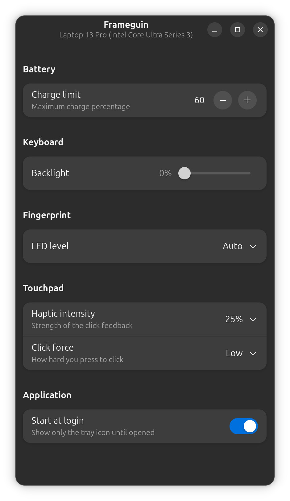
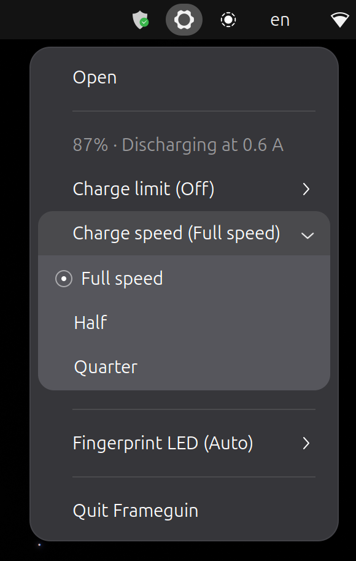

# Frameguin

An app for managing the hardware settings of a Framework laptop, from a
window or a tray icon. Written in Rust and split into an unprivileged GUI
and a root D-Bus daemon.

This is a community project, not affiliated with or endorsed by Framework
Computer Inc. "Framework" and the gear logo are trademarks of Framework
Computer Inc. Licensed under the [MIT License](LICENSE).

[**Latest release**](https://github.com/valeronm/frameguin/releases/latest)
· [Install](#install) · [Report a bug](https://github.com/valeronm/frameguin/issues)



## What it does

- **Battery** — the current flowing in or out, a ceiling on how full it
  charges, and a cap on the charging rate.
- **Fingerprint reader** — LED brightness as a level or a percentage, and off.
- **Touchpad** — haptic click intensity and click force.

A charge limit set here lasts until reboot: UEFI setup re-sends its own
stored value at every POST, so the standing limit lives in BIOS setup.

Closing the window hides it to the tray; **Quit Frameguin** in the tray menu
is the real exit. **Start at login** brings up the tray icon only.



## Alternatives

Other community projects reach the same hardware, and one of them may suit
you better. Frameguin exists for a particular shape: the GUI holds no
privileged access of its own, and the controls live in the tray, a menu away
rather than an app to launch.

The others are shaped differently:

- **[framework_tool](https://github.com/FrameworkComputer/framework-system)** —
  Framework's own CLI, on the `framework_lib` this app also links, run under
  `sudo` per invocation.
- **[YAFI](https://github.com/Steve-Tech/YAFI)** — also a GTK4/libadwaita app,
  with the GUI reaching the EC itself rather than through a privileged
  service.
- **[framework-tool-tui](https://github.com/grouzen/framework-tool-tui)** — a
  terminal dashboard over the same `framework_lib`, run entirely under `sudo`.
- **[framework-control](https://github.com/ozturkkl/framework-control)** — a
  background service with a browser UI.

## Requirements

- **A Framework laptop with a Framework mainboard.** `framework_lib`, which
  every control goes through, does not speak to third-party boards built for
  the same chassis. Developed and tested on the Laptop 13 Pro (Intel Core
  Ultra Series 3), BIOS 03.02. Other Framework boards should work, and
  reports from them are welcome.
- **GTK 4 with libadwaita 1.4 or newer** — Ubuntu 24.04, Debian 13, Fedora 40
  or their equivalents. The `.deb` will refuse to install on anything older.
- **A tray implementation, for the tray icon only.** The window works
  anywhere. KDE and Xfce have one natively; stock GNOME needs the
  [AppIndicator extension](https://extensions.gnome.org/extension/615/appindicator-support/)
  (preinstalled on Ubuntu). Without it there is no tray menu, and **Start at
  login** — which starts the tray alone — leaves nothing visible.

## Install

None of these needs a Rust toolchain or the `-dev` packages.

### Debian and Ubuntu

Take the `.deb` from the
[latest release](https://github.com/valeronm/frameguin/releases/latest):

```sh
sudo apt install ./frameguin_*.deb
```

apt pulls in GTK 4, libadwaita and polkit. Prefer this over the tarball here:
the two write competing copies under `/usr` and `/usr/local`, and dpkg only
tracks its own — uninstall one before installing the other.

### Anything else

A tarball carrying the same installer the source build uses:

```sh
curl -fsSL https://raw.githubusercontent.com/valeronm/frameguin/main/packaging/get.sh | sh
```

That downloads and unpacks as your user and runs only the installer under
`sudo`. Read it first if you'd rather — it is
[packaging/get.sh](packaging/get.sh).

By hand, from the same release page: download
`frameguin-<version>-x86_64-linux.tar.gz` and the `.sha256` beside it, then

```sh
sha256sum -c frameguin-*-x86_64-linux.tar.gz.sha256
tar -xzf frameguin-*-x86_64-linux.tar.gz
sudo ./frameguin-*-x86_64-linux/install.sh
```

A tarball declares no dependencies, so GTK 4 and libadwaita must already be
present; the installer checks before writing anything and names the package
to install if they are not.

Either way, launch with `frameguin` or from the app grid.

## Updating

- **`.deb`** — download the new one and `sudo apt install ./frameguin_*.deb`.
- **Tarball** — re-run the same `curl … | sh`.
- **Source** — `git pull && cargo build --release && sudo ./install.sh`.

All three are idempotent: they stop the daemon, replace the files, and
restart the tray app if it was running.

## Uninstall

Installed from the `.deb`:

```sh
sudo apt purge frameguin
```

`apt remove` keeps the remembered touchpad settings in `/var/lib/frameguin`;
only `apt purge` drops them.

Installed from the tarball or from source:

```sh
sudo /usr/local/libexec/frameguin-uninstall.sh
```

That path follows the install prefix: `install.sh` puts a copy of itself
there, so a `curl … | sh` install can be removed without re-downloading
anything and a `PREFIX` install undoes itself. It also removes that state
directory.

Then, either way:

```sh
rm -f ~/.config/autostart/io.github.valeronm.Frameguin.desktop
```

**Start at login** writes that entry per user, and no uninstaller can reach
another user's home directory. A leftover entry is harmless: it carries
`TryExec`, so a session skips it once the binary is gone.

## Troubleshooting

**No controls, "No Framework hardware detected"** — the DMI vendor is not
`Framework`. Expected on other machines.

**Some controls missing** — the daemon probes each operation and shows only
what the board answers to. `frameguin --debug-info` lists what it found.

**No tray icon on GNOME** — install the AppIndicator extension (see
Requirements).

**A password prompt for every change** — polkit allows an active local
session without one. Over SSH, or from an inactive session, admin
authentication is required by design.

```sh
# board, both versions with the paths they ran from, EC version, capabilities
frameguin --debug-info
# daemon logs
sudo journalctl -u frameguin-daemon.service
```

Two different prefixes on those first lines mean two installs are present and
shadowing each other; see Uninstall.

## How it works

Controls are capability-driven: the daemon probes the hardware once
(`GetCapabilities`) and the app only shows the groups the board supports, so
new boards work without code changes. The board name in the header comes
from DMI sysfs. Frameguin currently covers the everyday controls, with more
of `framework_tool`'s surface planned.

Cargo workspace:

- `daemon/` (`frameguin-daemon`) — owns
  `io.github.valeronm.Frameguin` on the **system bus**, runs as root,
  links `framework_lib` (default features off plus `hidapi`, used by the
  haptic touchpad support and its capability probe).
  D-Bus-activated via systemd (`Type=dbus`), exits after 5 minutes idle.
  Setters are polkit-gated.
- `app/` (`frameguin`) — gtk4-rs + libadwaita GUI talking to the
  daemon over zbus.
- `data/` — D-Bus system bus policy + activation file, systemd unit, polkit
  policy, desktop entry, AppStream metainfo, icons. `*.in` files carry the
  daemon's absolute path and are rendered per prefix by
  `packaging/render-data.sh`.
- `packaging/` — the `.deb` build (`build-deb.sh`, maintainer scripts,
  Debian changelog), the tarball build (`build-tarball.sh`) and its
  downloader (`get.sh`), and `check-version.sh`, which both builders run to
  cross-check every place a version is written.

### Security model

The daemon runs as root (required for `/dev/cros_ec` and hidraw access),
started only by systemd via D-Bus activation, with `ProtectHome`,
`PrivateTmp`, and a systemd-owned `StateDirectory`. Authorization is
layered:

- **Name ownership** — the bus policy allows only root to own
  `io.github.valeronm.Frameguin`, so the daemon can't be impersonated.
- **Reach** — any local user or process may call the daemon; filtering
  happens per method, not per connection.
- **Setters** — every state-changing method asks polkit to authorize the
  message sender (kernel-verified identity) against
  `io.github.valeronm.frameguin.manage`: an **active local session**
  is allowed without a password (the same trust GNOME grants screen
  brightness — someone at the console has the hardware keys anyway);
  inactive sessions are denied; everything else (SSH, daemons) needs admin
  authentication via a polkit agent.
- **Getters** are unauthenticated: they expose only hardware metadata
  (current levels, capabilities, EC version).
- **Surface** — a fixed set of operations with all inputs validated against
  hardware-accepted values; no raw command passthrough.

## Build from source

`mise install` provides the pinned Rust toolchain and cargo-deb; without
[mise](https://mise.jdx.dev), install Rust 1.97+ yourself and
`cargo install cargo-deb`. Then the system libraries:

```sh
sudo apt install libgtk-4-dev libadwaita-1-dev libudev-dev pkg-config build-essential
```

```sh
cargo build --release
sudo ./install.sh
```

This installs under `/usr/local`, the FHS slot for software outside the
package manager. `PREFIX` moves the two binaries; polkit, D-Bus and the icon
theme only read from fixed system directories, so those files stay put.

### Building packages

```sh
./packaging/build-deb.sh                            # target/debian/
./packaging/build-tarball.sh                        # target/dist/
```

Both run `packaging/check-version.sh` first. The `.deb` build then lints its
result: lintian over the package, appstreamcli over the metainfo,
desktop-file-validate over the desktop entry.

### Releasing

The version is spelled in several places that nothing derives from each
other. Bump them all, then tag:

- `version` in the workspace `Cargo.toml` (both crates inherit it)
- `packaging/changelog` — a new entry, with a distribution rather than
  `UNRELEASED`, and the Debian revision suffix (`0.2.0-1`) the check strips
  before comparing
- `<release version=… date=…/>` in `data/*.metainfo.xml`, at the top of the
  block — the check reads the first entry, so one appended below passes while
  the newest release stays wrong
- `Cargo.lock`, which any `cargo` command refreshes — the builds pass
  `--locked`, so a lock that disagrees with the manifest stops them
- the `v`-prefixed git tag

```sh
./packaging/build-deb.sh --expect 0.2.0       # the whole gate, before tagging
./packaging/build-tarball.sh --expect 0.2.0
```

`check-version.sh` cross-checks the copies against `Cargo.toml`; `--expect`
adds the tag. A release that would fail in CI fails here first. Pushing the
tag builds both artifacts and attaches them, with the tarball's checksum, to
a GitHub release whose body is the newest changelog stanza, rendered by
`packaging/release-notes.sh` — so the bullets written for `apt changelog`
are what the release page says too.
The same workflow runs on every push to `main` and every pull request without
the release step.

## Contributing

Issues and pull requests welcome:
<https://github.com/valeronm/frameguin/issues>

Capability reports from boards other than the Laptop 13 Pro are especially
useful. Include the output of `frameguin --debug-info` — the same report the
main menu → **About Frameguin** → **Troubleshooting** page offers behind a
copy button.
